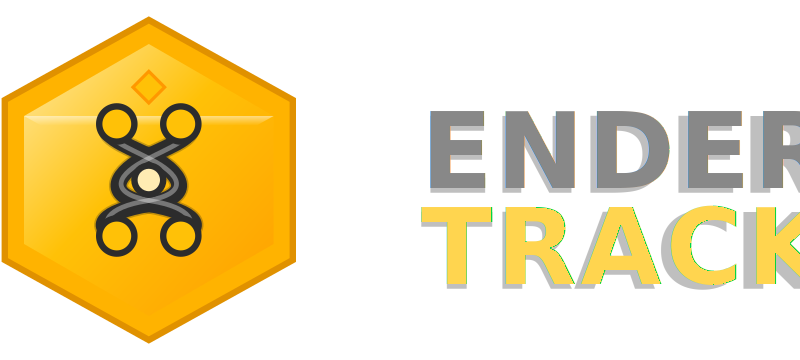

# EnderTrack

<p align="center">
  
</p>

<p align="center">
  <strong>Contrôleur de position 3D pour platines XYZ motorisées.</strong><br>
  Simulateur intégré ou pilotage réel via G-code (USB série). Interface web légère avec serveur Python.
</p>

---

## Versions

| Branche | Description | Commande |
|---------|-------------|----------|
| [`basic`](../../tree/basic) | Version minimale — navigation, listes de positions, connexion série | `git clone -b basic https://github.com/Hugo-LE-GUENNO/EnderTrack.git` |
| [`plugins`](../../tree/plugins) | Plugins additionnels compatibles | `git clone -b plugins https://github.com/Hugo-LE-GUENNO/EnderTrack.git` |

## Démarrage rapide

```bash
git clone -b basic https://github.com/Hugo-LE-GUENNO/EnderTrack.git
cd EnderTrack
python3 endertrack-server.py
```

Ouvrir http://localhost:5000 — c'est tout. Zéro installation, les dépendances sont incluses.

## Fonctionnalités

- **Visualisation XY + Z** — temps réel si connecté, simulateur sinon
- **Navigation** — pas à pas (flèches clavier) ou positionnement absolu (clic sur canvas)
- **Listes de positions** — sauvegarde, chargement, automatisation simple
- **Plugins** — système extensible, déposer un dossier dans `plugins/`

## Plugins

| Plugin | Description |
|--------|-------------|
| 🎮 Contrôleur Externe | Mapping personnalisable clavier + gamepad |
| 🔩 Extruder | Contrôle moteur extrudeur |
| 🌡️ TempoBed | Contrôle température plateau chauffant |

Pour installer un plugin : copiez son dossier dans `plugins/` puis activez-le dans Réglages → Extensions.

## Liens

- [enderscope.py](https://github.com/mutterer/enderscopy) ([publication](https://dx.doi.org/10.1016/j.softx.2025.102210))
- [EnderScope](https://github.com/Pickering-Lab/EnderScope) ([publication](http://doi.org/10.1098/rsta.2023.0214))
- [diy.microscopie.org](https://diy.microscopie.org/explore.html)

## Licence

GPLv3 — Hugo Le Guenno, 2025

*Né au CNRS suite à l'école thématique MIFOBIO 2025, porté par l'EnderTeam.*
