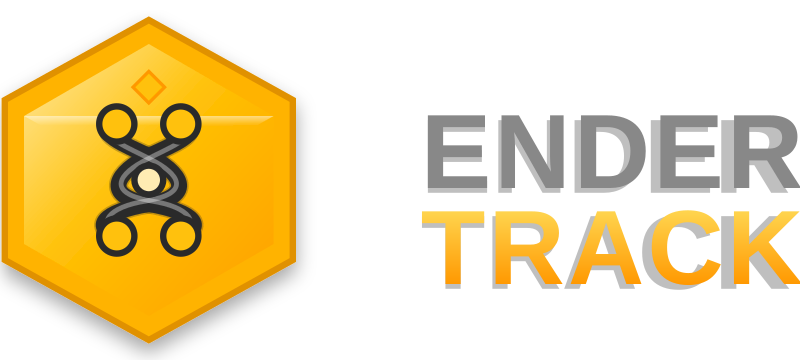

# EnderTrack

<p align="center">
  
</p>

<p align="center">
  <strong>Contrôleur de position 3D pour platines XYZ motorisées.</strong><br>
  Interface web + serveur Python. Simulateur intégré ou pilotage réel via G-code.
</p>

---

## Installation

```bash
git clone -b imagerie https://github.com/Hugo-LE-GUENNO/EnderTrack.git
cd EnderTrack
python3 endertrack-server.py
```

Ouvrir http://localhost:5000 — zéro installation, dépendances incluses.

Mettre à jour : `git pull`

Accès tablette/téléphone : `python3 endertrack-server.py --lan` · 👉 **[Réseau, hotspot, RPi](docs/network.md)**

## Éditions

Chaque édition est une **branche** avec ses propres modules.

| Édition | Modules | Version |
|---------|---------|---------|
| [`basic`](../../tree/basic) | Navigation, listes, tactile, responsive | v2.4.0 |
| [`imagerie`](../../tree/imagerie) | basic + caméra, éclairage, acquisition, scénarios | v1.2.3 |
| [`plotter`](../../tree/plotter) | basic + pen plotter (image → tracé XY) | v1.0.0 |

Pour une autre édition : `git clone -b <edition> https://github.com/Hugo-LE-GUENNO/EnderTrack.git`

## Plugins

Compatibles avec toutes les éditions.

Installation (remplacer `<plugin>` par le nom ci-dessous) :
```bash
git clone -b plugins https://github.com/Hugo-LE-GUENNO/EnderTrack.git /tmp/et-plugins
cp -r /tmp/et-plugins/plugins/<plugin> plugins/
```

Ou via l'interface : Réglages → Extensions → Catalogue.

| Plugin | `<plugin>` | Description |
|--------|-----------|-------------|
| 🎮 Contrôleur Externe | `external-controller` | Mapping clavier + gamepad |
| 🔩 Extruder | `extruder` | Contrôle moteur extrudeur |
| 🌡️ TempoBed | `tempo-bed` | Température plateau chauffant |

👉 **[Créer un plugin](docs/plugins.md)** · Catalogue : branche [`plugins`](../../tree/plugins)

## Contribuer

| Contribution | Comment |
|-------------|---------|
| 🔌 Plugin | Fork → branche `plugins` → PR |
| 🔬 Édition spécialisée | Fork → branche depuis `basic` → PR |
| 🐛 Bug / idée | [Issue](../../issues) |

👉 **[CONTRIBUTING.md](CONTRIBUTING.md)** · **[Créer un module](docs/modules.md)**

## À propos

EnderTrack est né comme interface de pilotage pour [EnderScope](https://github.com/Pickering-Lab/EnderScope) ([publi](http://doi.org/10.1098/rsta.2023.0214)), un microscope DIY construit à partir d'une imprimante 3D Ender. Le projet utilise [enderscope.py](https://github.com/mutterer/enderscopy) ([publi](https://dx.doi.org/10.1016/j.softx.2025.102210)) pour communiquer en G-code avec la platine motorisée.

En pratique, EnderTrack pilote n'importe quelle platine XYZ compatible G-code — imprimantes 3D, stages de microscope, CNC, ou tout appareil contrôlé par série USB.

Projet initié au CNRS suite à l'école thématique de microscopie [MIFOBIO](https://mifobio.fr) 2025. Plus de ressources sur [diy.microscopie.org](https://diy.microscopie.org/explore.html).

### Remerciements

- [EnderScope](https://github.com/Pickering-Lab/EnderScope) — Pickering Lab (projet original)
- Jérôme, Erwan et Aliénor — EnderTeam
- CNRS / RTmfm (Groupe de Travail "PPP")

## Licence

GPLv3 — Hugo Le Guenno, 2025
